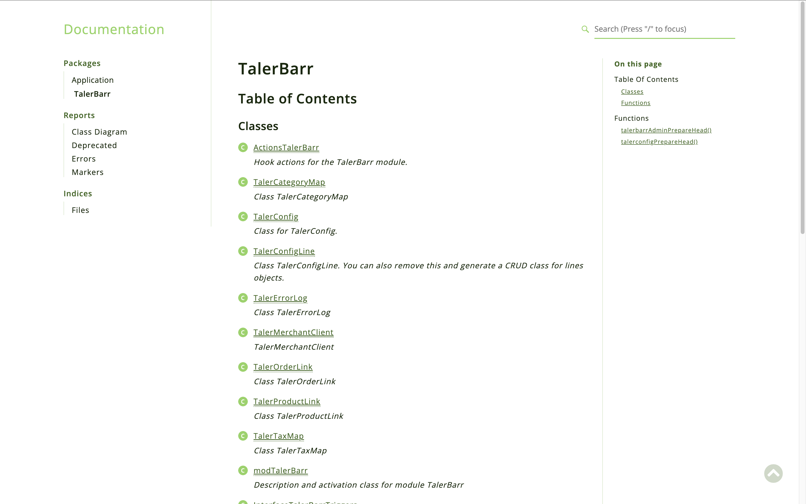
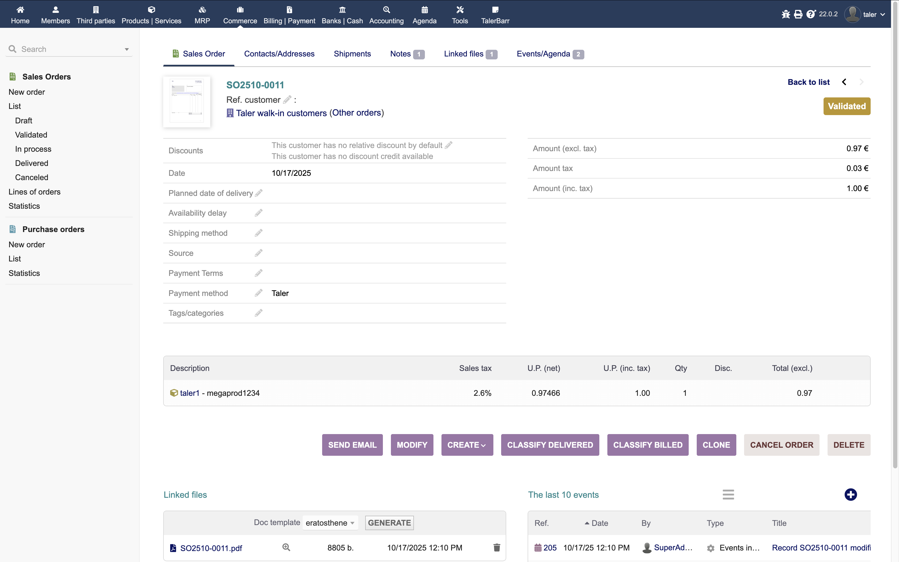

# Phase 2 report

## Brief

### DB-schema adjustments
The database schema was extended to include tables/objects for orders, invoices, and payments.
As well, renaming was done for easier maintaining of the module.

### Programming
Git diff from the time of phase 1 report to the time of phase 2 report:

### UI
Updates were done to show the order information.

Update of the main page to reflect the extended information of sync plus more information on config.

### Testing
New static and integration tests were added to cover the new order payment logic. 

### Documentation

The documentation in code comments, of course, now contains all classes related to invoices and payments.
Also, the restructuring has happened so that it is a bit easier to navigate through it.

 

## Long 

The main idea of this phase is to extend the functionality of the module to quickly and easily synchronize 
orders information. One of our main goals is to make this module easy to set up for everyone.
So to keep this true, on the initialization of the module we pre-create Taler clearing account and Taler default 
customer, as well we add new payment method "Taler" to Dolibarr payment methods.

Let's show how it will work, firstly, we will try to use Taler Merchant Backend SPAA to create order.

Then we press save, and we have the order information available

Now let's go to Dolibarr and see that the order is already here

Great, so now we can provide qr code to customer and pay it with Taler wallet.

Payment went through lets' comeback to Dolibarr and check has payment appeared or not.
And we can see that the related object has appeared.

Let's check this object(invoice file)

As we can see payment went through and all documents were created to show this transaction.
It is fully cleared using the pre-created clearing account.

Now let's try to create order from Dolibarr side (I changed the config to sync from Dolibarr to Taler).
And now inside standard order creation of the Dolibarr. Here we have to select that the payment method is Taler.

After we create the order, fill it with goods and validate it. The request will be sent to Taler and the 
order will be created there as well, with the same details.

Now we can navigate to Notes page in order and see the Taler status url, which contains qr code which customer can scan
and pay the order using Taler wallet. Where the user can see the order details and pay for it.

As user have paid, we can comeback to our Order, check related objects, and see that the status of invoice is already paid.

Let's check the invoice, and it is indeed paid, and cleared on the correct account.

And as such, sharing the payment link is the only new task that the user has to do to make the payment with Taler.
Everything else is done automatically by the module. Which we believe makes it very easy to use.
